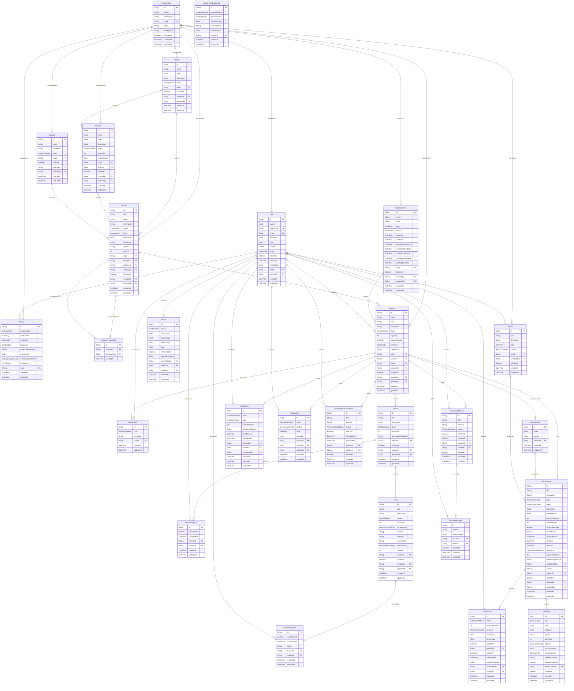

# 1BIS ALMA LMS — Entity Relationship Diagram

```mermaid
erDiagram
    %% ═══════════════════════════════════
    %% CORE ENTITIES
    %% ═══════════════════════════════════

    Organization {
        String id PK
        String name
        String description
        String code UK
        String logo
        String background
        Boolean isDeleted
        DateTime createdAt
        DateTime updatedAt
    }

    User {
        String id PK
        String avatar
        String userName UK
        String email UK
        String password
        Role role
        SubRole subRole
        UserStatus status
        Boolean isDeleted
        DateTime lastLogin
        String loginMethod
        String orgId FK
        String personId FK
        DateTime createdAt
        DateTime updatedAt
    }

    Person {
        String id PK
        PersonalInfo personalInfo
        Contact[] contactInfo
        Address[] addresses
        Language[] languages
        String preferredLanguage
        Json documents
        EmergencyContact[] emergencyContacts
        KYCStatus kycStatus
        String orgId FK
        DateTime createdAt
        DateTime updatedAt
    }

    %% ═══════════════════════════════════
    %% ACADEMIC STRUCTURE
    %% ═══════════════════════════════════

    Faculty {
        String id PK
        String name
        String code
        String description
        FacultyStatus status
        String orgId FK
        Boolean isDeleted
        String createdBy FK
        String updatedBy FK
        DateTime createdAt
        DateTime updatedAt
    }

    Program {
        String id PK
        String name
        String code
        String description
        ProgramStatus status
        Int totalUnits
        Json requirements
        String orgId FK
        String facultyId FK
        Boolean isDeleted
        String createdBy FK
        String updatedBy FK
        DateTime createdAt
        DateTime updatedAt
    }

    Category {
        String id PK
        String name
        String description
        CategoryStatus status
        String orgId FK
        Boolean isDeleted
        String createdBy FK
        String updatedBy FK
        DateTime createdAt
        DateTime updatedAt
    }

    AcademicTerm {
        String id PK
        String name
        String code
        TermType type
        TermStatus status
        DateTime startDate
        DateTime endDate
        DateTime enrollmentStartDate
        DateTime enrollmentEndDate
        DateTime addDropDeadline
        DateTime withdrawalDeadline
        DateTime gradingDeadline
        String orgId FK
        Boolean isDeleted
        String createdBy FK
        String updatedBy FK
        DateTime createdAt
        DateTime updatedAt
    }

    %% ═══════════════════════════════════
    %% COURSE & SECTION
    %% ═══════════════════════════════════

    Course {
        String id PK
        String title
        String code
        String description
        CourseStatus status
        CourseLevel level
        Float creditHours
        String thumbnail
        String syllabus
        Int version
        String orgId FK
        String facultyId FK
        String programId FK
        String categoryId FK
        Boolean isDeleted
        String createdBy FK
        String updatedBy FK
        DateTime createdAt
        DateTime updatedAt
    }

    CoursePrerequisite {
        String id PK
        String courseId FK
        String prerequisiteId FK
        DateTime createdAt
    }

    Section {
        String id PK
        String name
        String code
        String description
        SectionStatus status
        Int capacity
        Boolean waitlistEnabled
        Schedule[] schedules
        String meetingUrl
        String orgId FK
        String courseId FK
        String termId FK
        String instructorId FK
        Boolean isDeleted
        String createdBy FK
        String updatedBy FK
        DateTime createdAt
        DateTime updatedAt
    }

    SectionStaff {
        String id PK
        SectionStaffRole role
        String sectionId FK
        String userId FK
        DateTime createdAt
        DateTime updatedAt
    }

    %% ═══════════════════════════════════
    %% CONTENT (MODULES & LESSONS)
    %% ═══════════════════════════════════

    Module {
        String id PK
        String title
        String description
        ModuleStatus status
        Int sortOrder
        String prerequisiteModuleId
        String sectionId FK
        Boolean isDeleted
        String createdBy FK
        String updatedBy FK
        DateTime createdAt
        DateTime updatedAt
    }

    ModuleProgress {
        String id PK
        Boolean isCompleted
        DateTime completedAt
        String moduleId FK
        String studentId FK
        DateTime createdAt
        DateTime updatedAt
    }

    Lesson {
        String id PK
        String title
        String description
        LessonStatus status
        Int sortOrder
        LessonContentType contentType
        String content
        String videoUrl
        String externalUrl
        LessonAttachment[] attachments
        Int duration
        String moduleId FK
        Boolean isDeleted
        String createdBy FK
        String updatedBy FK
        DateTime createdAt
        DateTime updatedAt
    }

    LessonProgress {
        String id PK
        Boolean isCompleted
        DateTime completedAt
        String notes
        String lessonId FK
        String studentId FK
        DateTime createdAt
        DateTime updatedAt
    }

    %% ═══════════════════════════════════
    %% ASSESSMENTS & SUBMISSIONS
    %% ═══════════════════════════════════

    Assessment {
        String id PK
        String title
        String description
        AssessmentType type
        AssessmentStatus status
        Float totalPoints
        Float passingPoints
        Int timeLimitMinutes
        Int maxAttempts
        Boolean randomizeOrder
        Boolean showResults
        DateTime availableFrom
        DateTime dueDate
        DateTime closedAt
        LateSubmissionPolicy latePolicy
        Int gracePeriodHours
        Float latePenaltyPercent
        String gradeConfigId FK
        String rubricId FK
        String sectionId FK
        Boolean isDeleted
        String createdBy FK
        String updatedBy FK
        DateTime createdAt
        DateTime updatedAt
    }

    Question {
        String id PK
        QuestionType type
        String text
        String imageUrl
        Float points
        Int sortOrder
        QuestionOption[] options
        String correctAnswer
        MatchingPair[] matchingPairs
        String[] orderingAnswer
        Boolean allowPartialCredit
        String assessmentId FK
        Boolean isDeleted
        DateTime createdAt
        DateTime updatedAt
    }

    Submission {
        String id PK
        SubmissionStatus status
        Int attemptNumber
        QuestionAnswer[] answers
        Float totalScore
        Float percentage
        DateTime gradedAt
        String gradedBy FK
        DateTime startedAt
        DateTime submittedAt
        String overallFeedback
        String assessmentId FK
        String studentId FK
        DateTime createdAt
        DateTime updatedAt
    }

    %% ═══════════════════════════════════
    %% GRADING
    %% ═══════════════════════════════════

    GradeConfig {
        String id PK
        String name
        Float weight
        String sectionId FK
        DateTime createdAt
        DateTime updatedAt
    }

    Grade {
        String id PK
        GradeStatus status
        Float totalScore
        Float percentage
        String letterGrade
        Float gpa
        Boolean isOverridden
        String overrideReason
        String overriddenBy FK
        String sectionId FK
        String studentId FK
        DateTime createdAt
        DateTime updatedAt
    }

    SectionGradingConfig {
        String id PK
        GradingMethod gradingMethod
        GradingScale gradingScale
        Float passingGrade
        String roundingRule
        Json customScale
        String sectionId FK
        DateTime createdAt
        DateTime updatedAt
    }

    %% ═══════════════════════════════════
    %% ENROLLMENT & ATTENDANCE
    %% ═══════════════════════════════════

    Enrollment {
        String id PK
        EnrollmentStatus status
        EnrollmentType type
        Int waitlistPosition
        String withdrawalReason
        DateTime withdrawnAt
        DateTime completedAt
        String sectionId FK
        String studentId FK
        String processedBy FK
        DateTime enrolledAt
        DateTime createdAt
        DateTime updatedAt
    }

    Attendance {
        String id PK
        AttendanceStatus status
        AttendanceMethod method
        DateTime date
        String remarks
        String sectionId FK
        String studentId FK
        String markedBy FK
        DateTime createdAt
        DateTime updatedAt
    }

    %% ═══════════════════════════════════
    %% COMMUNICATION
    %% ═══════════════════════════════════

    SectionAnnouncement {
        String id PK
        String title
        String content
        AnnouncementStatus status
        Boolean isPinned
        DateTime scheduledAt
        DateTime publishedAt
        String sectionId FK
        String authorId FK
        Boolean isDeleted
        DateTime createdAt
        DateTime updatedAt
    }

    DiscussionThread {
        String id PK
        String title
        String content
        DiscussionStatus status
        Boolean isPinned
        Boolean isGraded
        String sectionId FK
        String authorId FK
        Boolean isDeleted
        DateTime createdAt
        DateTime updatedAt
    }

    DiscussionReply {
        String id PK
        String content
        String parentReplyId
        String threadId FK
        String authorId FK
        Boolean isDeleted
        DateTime createdAt
        DateTime updatedAt
    }

    %% ═══════════════════════════════════
    %% RUBRIC
    %% ═══════════════════════════════════

    Rubric {
        String id PK
        String title
        String description
        RubricType type
        RubricCriterion[] criteria
        String orgId FK
        String createdById FK
        Boolean isDeleted
        DateTime createdAt
        DateTime updatedAt
    }

    %% ═══════════════════════════════════
    %% RELATIONSHIPS
    %% ═══════════════════════════════════

    %% Organization owns everything
    Organization ||--o{ User : "has users"
    Organization ||--o{ Person : "has persons"
    Organization ||--o{ Faculty : "has faculties"
    Organization ||--o{ Program : "has programs"
    Organization ||--o{ Category : "has categories"
    Organization ||--o{ AcademicTerm : "has terms"
    Organization ||--o{ Course : "has courses"
    Organization ||--o{ Section : "has sections"
    Organization ||--o{ Rubric : "has rubrics"

    %% User ↔ Person
    User ||--o| Person : "has profile"

    %% Academic structure
    Faculty ||--o{ Program : "contains"
    Faculty ||--o{ Course : "offers"
    Program ||--o{ Course : "includes"
    Category ||--o{ Course : "classifies"

    %% Course ↔ Section
    Course ||--o{ Section : "offered as"
    Course ||--o{ CoursePrerequisite : "has prerequisites"
    Course ||--o{ CoursePrerequisite : "is prerequisite of"
    AcademicTerm ||--o{ Section : "contains"

    %% Section ↔ Instructor
    User ||--o{ Section : "instructs"
    User ||--o{ SectionStaff : "co-instructs"
    Section ||--o{ SectionStaff : "has staff"

    %% Section content
    Section ||--o{ Module : "contains"
    Module ||--o{ Lesson : "contains"
    Module ||--o{ ModuleProgress : "tracked by"
    Lesson ||--o{ LessonProgress : "tracked by"
    User ||--o{ ModuleProgress : "progresses"
    User ||--o{ LessonProgress : "progresses"

    %% Assessments
    Section ||--o{ Assessment : "has"
    Assessment ||--o{ Question : "contains"
    Assessment ||--o{ Submission : "receives"
    User ||--o{ Submission : "submits"
    GradeConfig ||--o{ Assessment : "categorizes"
    Rubric ||--o{ Assessment : "grades via"

    %% Grading
    Section ||--o{ GradeConfig : "configured with"
    User ||--o{ Grade : "receives"

    %% Enrollment & Attendance
    Section ||--o{ Enrollment : "enrolls"
    User ||--o{ Enrollment : "enrolled in"
    Section ||--o{ Attendance : "tracks"
    User ||--o{ Attendance : "attends"

    %% Communication
    Section ||--o{ SectionAnnouncement : "posts"
    User ||--o{ SectionAnnouncement : "authors"
    Section ||--o{ DiscussionThread : "hosts"
    User ||--o{ DiscussionThread : "creates"
    DiscussionThread ||--o{ DiscussionReply : "has replies"
    User ||--o{ DiscussionReply : "replies"

    %% Rubric authoring
    User ||--o{ Rubric : "creates"
```
